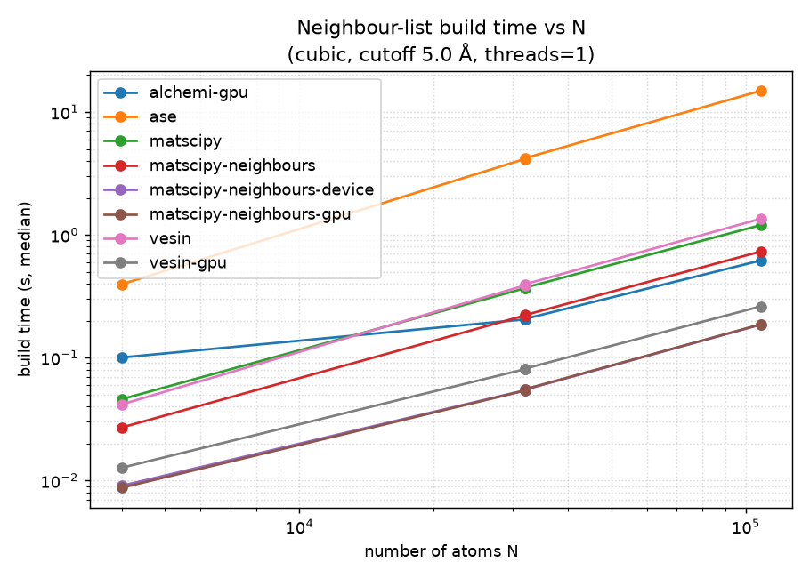
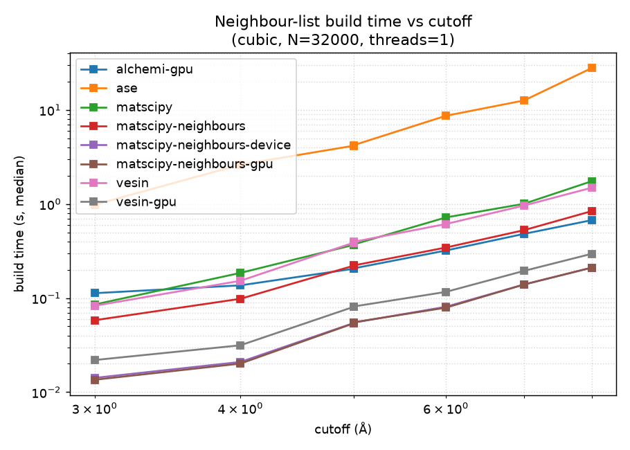
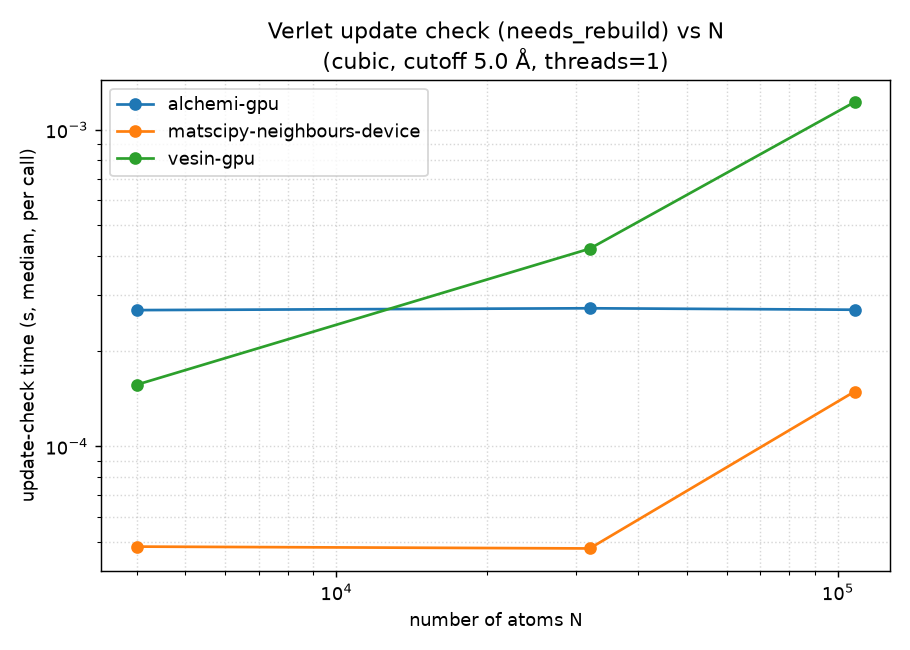

# ASE neighbour-list backend benchmark

Benchmarks ASE's in-tree neighbour-list paths against compiled backends
(matscipy, matscipy-neighbours, vesin) on periodic systems, and proves all
backends return identical lists first. See **[FINDINGS.md](FINDINGS.md)** for
results and conclusions.

## Backends (canonical `(i, j, d, D, S)`, `D = pos[j]-pos[i]+S@cell`)
| name | what it runs |
|------|--------------|
| `ase` | `primitive_neighbor_list` (cell-binning) |
| `ase-newprim` | `NewPrimitiveNeighborList` (thin wrapper over cell-binning) |
| `ase-ckdtree` | `PrimitiveNeighborList` (scipy cKDTree path; the `NeighborList` **default**) |
| `ase-ckdtree-vec` | prototype: same cKDTree query, vectorised array assembly (no ASE source edit; ~3.5× faster than `ase-ckdtree`) |
| `matscipy` | `matscipy.neighbours.neighbour_list` (optional) |
| `matscipy-neighbours` | `matscipy_neighbours.neighbour_list` — standalone compiled package, CPU (optional) |
| `matscipy-neighbours-gpu` | `matscipy_neighbours.neighbour_list` on a CUDA/HIP build via CuPy device positions (optional; see [GPU](#gpu-matscipy-neighbours)) |
| `vesin` | `vesin.ase_neighbor_list` (optional) |

**Experimental device-resident backends** (the [SPEC-device-neighbourlist.md](SPEC-device-neighbourlist.md) `DeviceNeighborList` protocol — build on-device, exchange via DLPack):

| name | what it runs |
|------|--------------|
| `matscipy-neighbours-device` | matscipy-neighbours (author) CUDA cell list via the device protocol (CuPy) |
| `vesin-gpu` | Vesin (ecosystem) CUDA cell list via the device protocol (CuPy) |
| `alchemi-gpu` | NVIDIA ALCHEMI (vendor) JAX/Warp cell list via the device protocol |

> Note: in released ASE 3.28.0 the cKDTree path is `PrimitiveNeighborList`, not
> `NewPrimitiveNeighborList` — the opposite of what the original brief assumed.
> See FINDINGS.md.

## Results (NVIDIA RTX A4500, cubic fcc Ni, 1 thread)

All backends return **identical** neighbour lists (correctness-gated before any
timing). Full analysis in **[FINDINGS.md](FINDINGS.md)**.

**Build time vs system size** (cutoff 5.0 Å) and **vs cutoff** (N = 32 000):




Median build time (ms):

| N | ase | matscipy | mn-CPU | vesin | **mn-gpu** | **mn-device** | **vesin-gpu** | **alchemi-gpu** |
|--:|--:|--:|--:|--:|--:|--:|--:|--:|
| 4 000 | 396 | 45.8 | 27.0 | 41.6 | **8.7** | 9.0 | 12.7 | 100.2 |
| 32 000 | 4157 | 367 | 221 | 388 | **53.8** | 54.2 | 80.5 | 204.8 |
| 108 000 | 14910 | 1200 | 732 | 1352 | **186** | 186 | 261 | 618 |

**Three independent GPU backends — matscipy-neighbours (author), Vesin (ecosystem),
and NVIDIA ALCHEMI (vendor) — run behind one experimental ASE `DeviceNeighborList`
protocol, all edge-exact vs the host oracle.** That author/ecosystem/vendor spread
is the evidence the abstraction isn't backend-specific.

**Verlet update check** (`needs_rebuild`, per call) — the cheap per-step test a
device-resident MD loop runs instead of rebuilding; **100–1000× cheaper than a
rebuild**, so skin reuse makes the per-step neighbour cost essentially free:



Takeaways: compiled CPU backends (matscipy/vesin) are ~10–17× faster than any ASE
pure-Python path; a GPU build adds roughly another ~4× end-to-end. The eager
per-call timing above flatters CPU and penalises the JAX backend (`alchemi-gpu`) by
measuring framework dispatch; the **compiled (`jax.jit`) head-to-head** in
[FINDINGS.md](FINDINGS.md) shows ALCHEMI's kernel is actually the fastest to *build*
while matscipy's native CUDA kernel is fastest to *update*.

## Setup
```sh
uv sync          # installs ase, matscipy, matscipy-neighbours, vesin, scipy, matplotlib, pytest
```
`matscipy-neighbours` is built from the sibling clone `../matscipy-neighbours`
(see `[tool.uv.sources]` in `pyproject.toml`); `uv sync` compiles a **CPU** wheel.

## GPU (matscipy-neighbours)

`matscipy-neighbours` has a compiled **CUDA/HIP** GPU backend (no Metal/MPS), so
the `matscipy-neighbours-gpu` benchmark backend reports unavailable and is
skipped on machines without an NVIDIA/AMD GPU + a GPU build + CuPy (e.g. Apple
Silicon). **Validated on an NVIDIA RTX A4500 (arch 86, CUDA 12.6, CuPy 14.1.1):
~3–4× faster than the fastest CPU backend, correctness gate + ctest + dlpack all
pass — see the [GPU run section in FINDINGS.md](FINDINGS.md#gpu-run-nvidia-rtx-a4500-cuda-126).**
To exercise it on an NVIDIA box:

```sh
# Find your GPU arch:  nvidia-smi --query-gpu=compute_cap --format=csv,noheader
#   e.g. 8.6 -> use 86 (RTX A4500); 8.0 -> 80 (A100). On an HPC box you may need
#   to `module load CUDA/<ver>` first so nvcc is on PATH (match cupy-cudaXXx).

# 1. Build matscipy-neighbours with CUDA (in ../matscipy-neighbours) and install
#    it into this env (replaces the CPU build):
uv pip install --no-deps --reinstall \
    -C cmake.define.ENABLE_CUDA=ON \
    -C cmake.define.CMAKE_CUDA_ARCHITECTURES=86 \
    ../matscipy-neighbours
uv pip install cupy-cuda12x          # CuPy matching your CUDA toolkit (or cupy-cuda11x)

# 2. Run the GPU backend (correctness gate copies device results to host).
#    NB: use --no-sync. A plain `uv run`/`uv sync` rebuilds matscipy-neighbours
#    from source WITHOUT the CUDA flags, silently clobbering the GPU wheel back to
#    CPU-only (the GPU backend then self-skips):
uv run --no-sync python benchmark.py --sizes 4000,32000 --cutoff 5.0 \
    --backends ase,matscipy-neighbours,matscipy-neighbours-gpu --out results/

# 3. The package's own GPU tests (separate CMake build, BUILD_TESTING=ON):
cmake -S ../matscipy-neighbours -B ../matscipy-neighbours/build-cuda \
    -DENABLE_CUDA=ON -DCMAKE_CUDA_ARCHITECTURES=86
cmake --build ../matscipy-neighbours/build-cuda --parallel
ctest --test-dir ../matscipy-neighbours/build-cuda --output-on-failure   # test_neighbour_list_gpu, ...
PYTHONPATH=../matscipy-neighbours/build-cuda:../matscipy-neighbours/language_bindings/python \
    uv run --no-sync pytest ../matscipy-neighbours/tests/test_dlpack.py  # device DLPack round-trip
```
GPU benchmark timing is **end-to-end** (host→device positions + device build +
device→host result copy). For AMD, swap
`ENABLE_CUDA`/`CMAKE_CUDA_ARCHITECTURES` for `ENABLE_HIP`/`CMAKE_HIP_ARCHITECTURES`
(e.g. `gfx90a`) and install the ROCm CuPy build.

## Use
```sh
# Correctness gate (also a pytest test)
uv run python correctness.py
uv run pytest correctness.py

# Benchmark (gates on correctness first)
uv run python benchmark.py --sizes 500,4000,32000 --cutoff 5.0 \
    --backends ase,ase-newprim,ase-ckdtree,matscipy,matscipy-neighbours,vesin --threads 1 --out results/

# Cutoff sweep at a fixed size, append to existing results
uv run python benchmark.py --append --no-size-sweep --sweep-size 32000 \
    --cutoff-sweep 3.0,8.0 --threads 1 --out results/

# Plots
uv run python plots.py --results results/

# Profile the cKDTree path (query vs assembly; workers=-1 probe)
uv run python profile_ckdtree.py --n 32000 --cutoff 5.0

# Decompose the cKDTree query (tree build vs traversal vs Python-list materialise)
uv run python probe_query.py --n 32000 --cutoff 5.0
```

### Key flags
`--sizes` target atom counts · `--cutoff` Å · `--cutoff-sweep` cutoffs at
`--sweep-size` · `--systems` `cubic,lowsym,slab` · `--backends` subset ·
`--threads` `1` pins `OMP_NUM_THREADS`, `0` = unpinned (comma list for both) ·
`--timeout` per-run seconds · `--append` / `--no-size-sweep` for staged runs.

## Files
`backends.py` adapter registry · `systems.py` test systems · `correctness.py`
equivalence gate · `benchmark.py` harness (subprocess-per-run: timeout + clean
peak-RSS + thread pinning) · `profile_ckdtree.py` (query-vs-assembly split,
`workers=-1`) · `probe_query.py` (query cost decomposition) · `plots.py` ·
`envinfo.py`.

Optional backends skip with a clear message if not installed; the benchmark
never runs timing unless the correctness gate passes.
